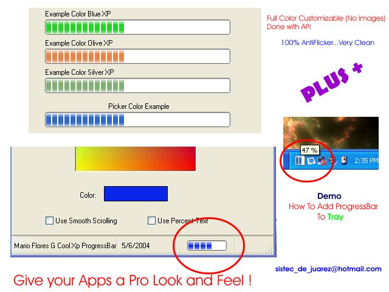



## Cool Xp Progress Bar \( Plus \+ ProgressBar in TaskBar example\)

### Description

Emulate the Windows Xp Progress Bar Control

Color Customizable no Pictures yust APi

Supports Standard,Smooth,Search styles

..Seen Alot of Progress Bar Controls on PSC,but didn't get the look an feel that i wanted.So i coded my own. This one is really clean and does not flicker ..cheers..
 
### More Info
 

             |
---                |---
**Submitted On**   |2004-05-08 16:17:34
**By**             |[MArio Flores G](https://github.com/Planet-Source-Code/PSCIndex/blob/master/ByAuthor/mario-flores-g.md)
**Level**          |Intermediate
**User Rating**    |4.8 (248 globes from 52 users)
**Compatibility**  |VB 6\.0
**Category**       |[Graphics](https://github.com/Planet-Source-Code/PSCIndex/blob/master/ByCategory/graphics__1-46.md)
**World**          |[Visual Basic](https://github.com/Planet-Source-Code/PSCIndex/blob/master/ByWorld/visual-basic.md)
**Archive File**   |[Cool\_Xp\_Pr174330582004\.zip](https://github.com/Planet-Source-Code/mario-flores-g-cool-xp-progress-bar-plus-progressbar-in-taskbar-example__1-53628/archive/master.zip)

